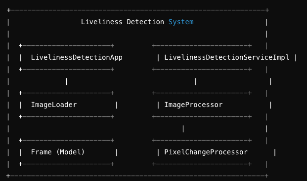
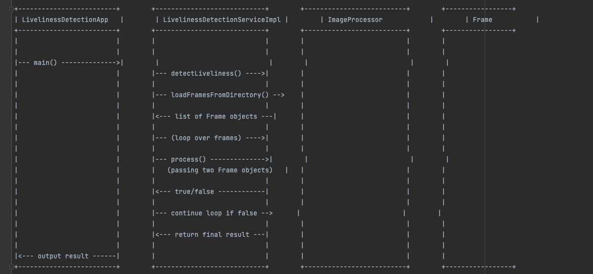
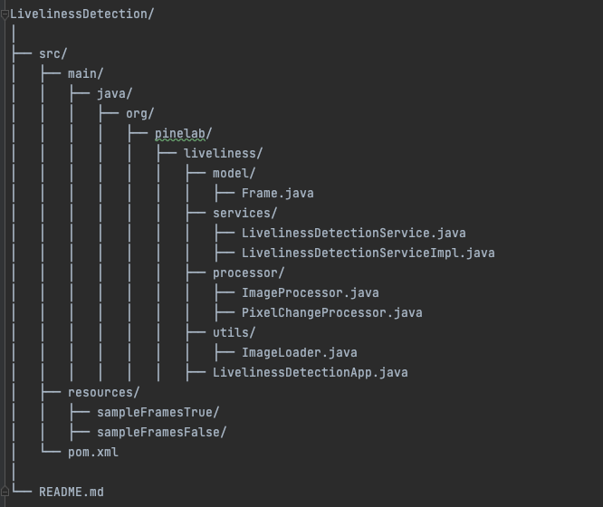
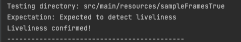
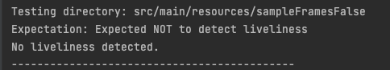

# Liveliness Detection

## Overview

This project is a Java-based implementation for detecting liveliness from a sequence of image frames. The main goal is to analyze consecutive frames to determine whether there is significant movement or change that suggests the subject in the images is "alive" (i.e., not a static image or a video loop). The system uses 30 frames extracted from a video and 30 static images for testing, all of which are stored in the `resources` folder.

## Algorithm Overview

The core algorithm used in this project is a pixel change detection method. The algorithm compares consecutive frames, pixel by pixel, to detect any significant changes between them. If enough pixels change between two consecutive frames, the algorithm concludes that liveliness is detected.

### Steps:
1. **Frame Loading**: Load images from the resources directory.
2. **Frame Comparison**: For each pair of consecutive frames, compare pixel values.
3. **Liveliness Detection**: If a significant change is detected between any pair of frames, liveliness is confirmed.

### High-Level Design (HLD)

#### Component Diagram




#### Sequence Diagram




### File Structure




### How to Run

1. Clone or download the repository.
2. Navigate to the project root.
3. Compile the project using Maven or your preferred IDE.
4. Run the `LivelinessDetectionApp` class.

### Example Command to Run:

If using an IDE:
- Run the `LivelinessDetectionApp` directly.

If using the command line:
```bash
mvn clean install
java -cp target/LivelinessDetection-1.0-SNAPSHOT.jar org.pinelab.liveliness.LivelinessDetectionApp
```


### Result Screenshots

Here are screenshots of running the application with two different sets of frames:

1. **Liveliness Detected** (sampleFramesTrue)
   

2. **No Liveliness Detected** (sampleFramesFalse)
   

### Using the Application with Any Set of Images

To use this application with any set of images:

1. Place your images in a new directory under `src/main/resources/`.
2. Update the `frameDirectory` in `LivelinessDetectionApp` to point to your new directory.
3. Run the application.

### Future Scope

- **Advanced Liveliness Detection**: Incorporate more sophisticated algorithms such as blink detection, facial movement, or texture analysis.
- **Real-Time Detection**: Extend the system to work with real-time video streams rather than pre-captured frames.
- **Scalability**: Enhance the system to handle large-scale deployments, potentially integrating with cloud services for distributed processing.

